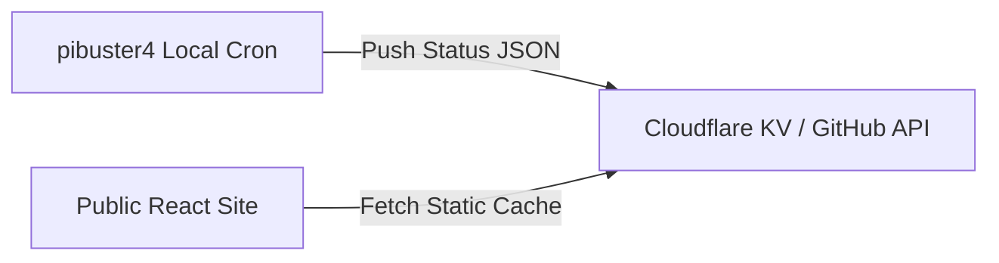

# TELEMETRY: Secure Health & Heartbeat Integration
> **Target:** Khurram Nazir Telemetry Systems  
> **Aesthetic Standard:** Gold Master V4.2.0 Compliant  
> **Status:** Planned V5.0.0 Architecture Spec

This document details the proposed architecture for pulling live, real-time node health and workload statuses from the private home network onto the public dashboard without exposing network ingress or storage backends.

---

## 1. The Challenge of Live Telemetry
Traditional live telemetry models query resources on-demand:
```
[Public Web Dashboard] ===(REST API Query)===> [Private Hypervisor Port]
```
This model is highly insecure for homelabs because:
1.  It requires opening network firewall ports or creating dynamic reverse proxy pathways straight to the local hypervisor admin endpoints.
2.  Exposes internal credentials or host paths to arbitrary public inspectors.
3.  Creates denial-of-service vulnerabilities on home routers if dashboard traffic spikes.

---

## 2. The Solution: Push-Based Stateless Heartbeats
To achieve active status visualization without exposing any local ports, the homelab site leverages an asynchronous, push-based stateless architecture.



1.  **Local Aggregator Systemd Job:** A lightweight, secure python/bash script runs every 5 minutes on the decoupled local node (`pibuster4`).
2.  **Telemetry Scrubbing & Anonymization:** The script compiles metrics:
    *   CPU Load, RAM Util, and Disk allocations.
    *   Dynamic container states (Active/Inactive boolean lists).
    *   Scrubs all local IP blocks, host MAC addresses, AD domains, and physical drive volume labels.
3.  **Public State Push:** The scrubbed JSON payload is POSTed via a secure, local API token route straight to a public static storage bridge:
    *   *Option A:* Pushed to a public **Cloudflare KV** namespace database.
    *   *Option B:* Committed directly to a public **GitHub gist** or JSON file inside the portfolio repository via standard GitHub API.
4.  **Decoupled Browser Fetch:** The public React dashboard queries the public static cache target asynchronously on component mount, retrieving simulated "real-time" data with zero direct inbound connections to the home network.
